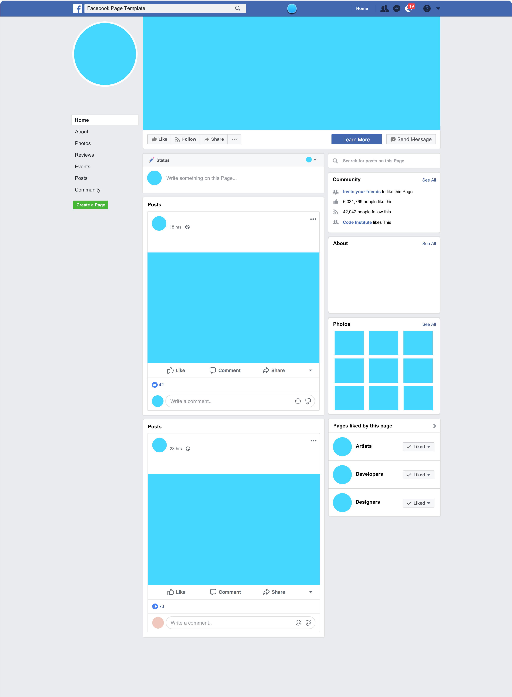

# SEO and Marketing

The SEO and Marketing section outlines the strategies used to increase visibility of the website in search engines and to attract and retain users through online channels. This section typically includes keyword research, marketing platform choices, and content strategies.

It helps demonstrate how the project considered real-world outreach and customer engagement beyond just building a functional website.

## SEO and Keywords

Describe the process used to identify and select keywords for the site. Keyword research tools like [Wordtracker](https://www.wordtracker.com/) or Google Keyword Planner can be mentioned, along with any insights from the research.

> Keyword research was conducted using Wordtracker and targeted terms like "_product name_" were chosen to reflect both product offerings and customer search intent.

You can include screenshots of keyword research as evidence.

Explain how the selected keywords were incorporated into the site (e.g., meta tags, product titles, alt text, blog content).

## Marketing Strategy

Outline your marketing plan and audience. Use guiding questions like:

- What kind of business is it (B2C/B2B)?
- Who are the customers?
- What platforms are they on?

> The business is B2C, targeting customers interested in locally made _product_. Facebook and Instagram were chosen as key platforms due to the visual nature of the products.

## Content Marketing

Highlight any features added to support content marketing, such as a blog, recipe section, or user-generated content.

> A blog was added to drive repeat visits and promote customer engagement through comments and submissions. Future expansion could include ...

You can explain the reasoning behind these features and their impact on SEO and user retention.

### Social Media

Discuss which platforms were chosen and why, and include mockups or screenshots. A real Facebook page is not required, but at least a mockup must be included.

> Facebook was selected as the primary communication platform, with potential for expansion into Instagram and YouTube for visual content and recipe videos.

Social Media Mockup

## Email Marketing

Newsletter signup is a requirement for this project. Either by integrating [MailChimp](https://mailchimp.com) or creating your own app in the project.

> A Mailchimp-powered newsletter was implemented to notify customers of new products, recipes, and offer discount codes.

You can briefly mention how users sign up (e.g., via footer form) and what kind of emails they would expect to receive.
